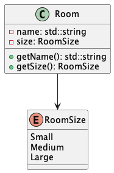

# Class Diagrams

The following diagrams demonstrate the individual classes our software will be made up of, and the connections between them.

## Class Diagram Overview

## Robot Class
There will be a parent class of **Robot** which will represent a general robot of which can have a status of either *idle*, *active*, or *fault* -- attributes which are important for managing the availability of robots or if they need to be fixed. There can be only two sizes of robots, *small* or *large*, each of which can be either a *sweeper*, *vacuum*, or *mopping* robot. Each of the robot types can only complete its matching task, i.e. a sweeper robot can only sweep but not vacuum or mop. Robots of small size can only clean small size rooms due to their battery capacity. Because of this distinction, the robot's actions are interfaces that will be implemented differently based on the robot's size.

## Room Class
There are three sizes of rooms in the building - *small*, *medium*, and *large*. The size of the room is important because large robots can clean any size room, but small robots can only clean small rooms. Each size room will have its own class and inherit from a general parent room class, where it is given a corresponding integer to its size.

