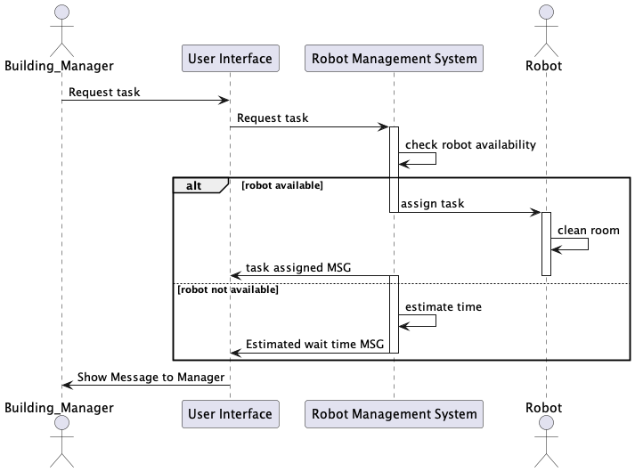
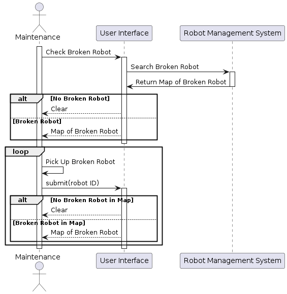

# Sequence Diagrams

The following diagrams demonstrate the interactions between actors and components of our software. These are used for planning, prior to any coding, and may be updated as we progress.

There are two main actors who will be interacting with our system: the **building manager** and **maintenance**. 

## **Building Manager**
### **Request a Cleaning**
The building manager (BM) will be able to request a cleaning of a specific type (sweeping, vacuuming, mopping) for a specific room in their building. The BM will be in direct contact with the User Interface of our system, which will then communicate with the Robot Management System (RMS) in order to pass information between the customer and the robot. From the BM's perspective, they will simply request the task and be returned a message that will either specify that the task was succesfullly assigned, or be given a wait time for the next available robot.

## **Maintenance**
### **Check for Broken Robots**
The maintenance team will be able to check the status of all the robots in order to pick up broken ones to be fixed. As with the BM, maintenance will only interact with the UI which will communicate with the RMS. When requesting robot information, the maintenance team will be given a map of all the broken robots. After fixing one robot, they should return to the program to submit the fixed robot's ID number to notify the system that it is working again.

